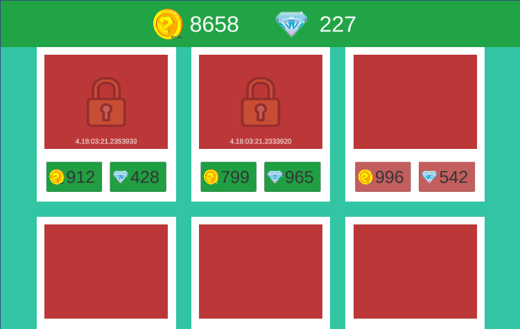

Тестовое задание вёрстка магазина. 

Изначально было решено сделать через фабрику, но в ходер разработки пришлось отказаться от идеи, т.к не хватило времени на исправление багов.

В приложении есть N игровых предметов.
Предметы абстрактны и об их реализации нам ничего неизвестно.
Предмет можно приобрести следующим образом:
- Покупка за внутриигровую валюту

- Покупка за другой тип валюты.
- Доступ к предмету на ограниченное время (в часах или минутах)
- Визуально на сцене располагается N предметов и несколько кнопок под каждым из них -
каждая кнопка это отдельный вариант приобретения предмета. Пользователь может
нажать на кнопку и приобрести предмет.
- Если предмет не приобретен никаким из обозначенных способов - он заблокирован.
Если хотя бы один способ был активирован - предмет доступен.
- Блокировка предмета идет как в коде так и отображается визуально для пользователя.
- В случае если предмет доступен на ограниченное время - у предмета есть view, которое
показывает оставшееся время в формате часы : минуты : секунды.
Решение должно быть масштабируемым, то есть можно добавлять новый тип игровых
предметов или новый способ покупки товара - при этом менять базовую часть кода не
нужно.
Данные о покупках и измененных статусах игровых предметов обязательно должны
сохраняться между сессиями.
UI магазина должен быть сверстан в Canvas системе и должен быть адаптирован как к
portrait режиму так и к landscape.

    
    
Изменение цветов формы

